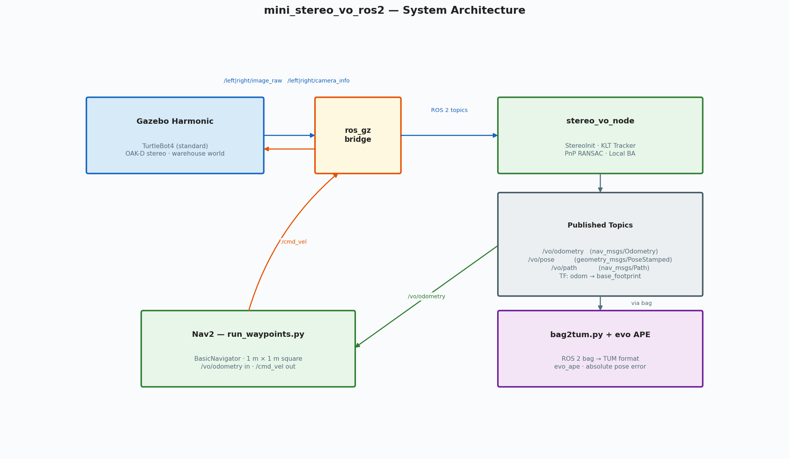
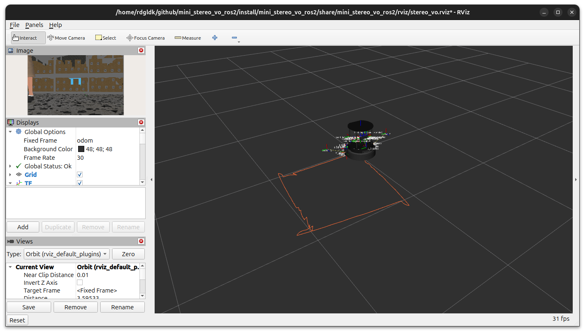
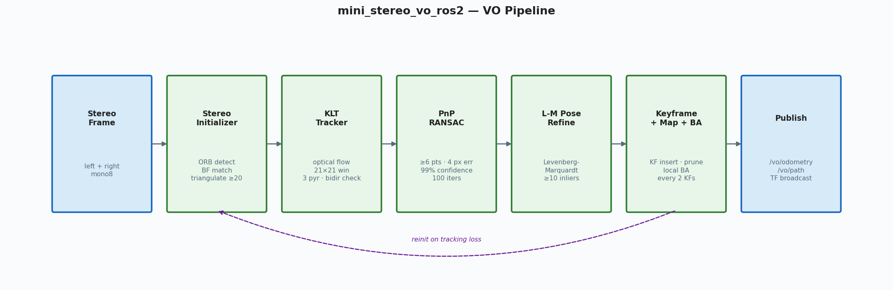
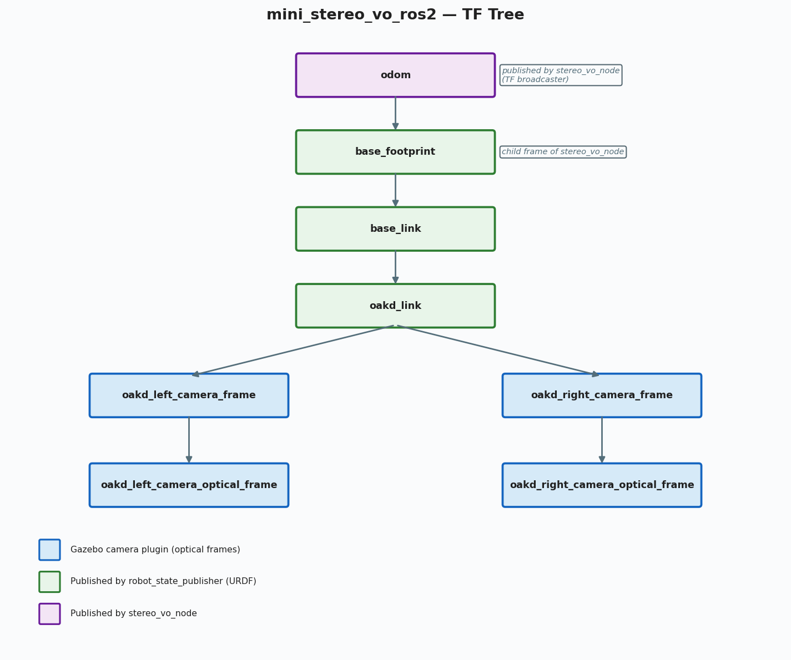

# mini_stereo_vo_ros2

Stereo Visual Odometry in a ROS 2 Jazzy + Gazebo Harmonic simulation.  
Wraps [mini_stereo_vo](https://github.com/rdgldkthu/mini_stereo_vo) — a
compiled C++ stereo VO library — in a ROS 2 node, simulates a TurtleBot4
with stereo cameras in the Gazebo warehouse world, drives it through
configurable waypoints using VO odometry feedback, and evaluates trajectory
accuracy with evo APE.

---

## System architecture



| Layer | Components |
|-------|-----------|
| **Simulation** | Gazebo Harmonic, TurtleBot4 (standard), custom OAK-D stereo plugin, DiffDrive |
| **Bridge** | `ros_gz_bridge` — stereo images, camera info, `/cmd_vel` |
| **Odometry** | `stereo_vo_node` — StereoInitializer → LKT Tracker → PnP RANSAC → Local BA |
| **Navigation** | Direct `/cmd_vel` P-controller (`run_waypoints.py`, `drive_square.py`) |
| **Evaluation** | `bag2tum.py` + evo APE |

---

## Prerequisites

| Dependency | Version / package |
|-----------|-------------------|
| Ubuntu | 24.04 (Noble) |
| ROS 2 | Jazzy (native install) |
| Gazebo | Harmonic (`gz-harmonic`) |
| TurtleBot4 sim | `ros-jazzy-turtlebot4-gz-bringup` |
| Bridge | `ros-jazzy-ros-gz-bridge` |
| Evaluation | `pip install evo` |

```bash
sudo apt install \
  ros-jazzy-turtlebot4-gz-bringup \
  ros-jazzy-ros-gz-bridge \
  ros-jazzy-cv-bridge \
  ros-jazzy-image-transport \
  ros-jazzy-tf2-ros

pip install evo
```

---

## Workspace layout

```text
mini_stereo_vo_ros2/               ← repo root = colcon workspace root
├── src/
│   ├── mini_stereo_vo/            ← git submodule (read-only)
│   └── mini_stereo_vo_ros2/       ← ROS 2 package
│       ├── config/stereo_vo_params.yaml
│       ├── launch/stereo_vo_gazebo.launch.py
│       ├── src/stereo_vo_node.cpp
│       ├── rviz/stereo_vo.rviz
│       └── urdf/turtlebot4_stereo.urdf.xacro
├── scripts/
│   ├── bag2tum.py          ← bag → TUM + evo APE
│   ├── run_waypoints.py    ← Nav2 square loop
│   ├── cmd_vel_relay.py    ← Twist relay utility
│   └── gen_readme_images.py← regenerate docs/images/
├── docs/images/
└── Makefile
```

---

## Build

```bash
# Clone with submodule
git clone --recurse-submodules <repo-url>
cd mini_stereo_vo_ros2

# Source ROS 2
source /opt/ros/jazzy/setup.bash

# Build (from repo root)
make build
source install/setup.bash
```

---

## Quick start

### 1 — Start the full simulation

```bash
make sim
```

This single command launches:

1. **Gazebo Harmonic** — warehouse world, TurtleBot4 spawned after 30 s
2. **robot_state_publisher** — custom URDF with stereo camera sensors
3. **ros_gz_bridge** — `/left/image_raw`, `/right/image_raw`, `/left|right/camera_info`, `/cmd_vel`
4. **stereo_vo_node** — reads stereo images, publishes `/vo/odometry`, `/vo/path`, TF
5. **RViz2** — pre-configured with path, camera image, and TF displays

### 2 — Drive the robot

Both driving scripts use only VO odometry (`/vo/odometry`) and `/cmd_vel` — no Nav2 or `map` frame required.

**Timed square loop** — fixed duration per side, no pose feedback:

```bash
# in a second terminal
source install/setup.bash
python3 scripts/drive_square.py          # 1.5 m square, 0.3 m/s
python3 scripts/drive_square.py --side 1.0 --loops 3   # smaller, 3 laps
```

**Odometry-based waypoints** — P-controller closes the loop on VO pose:

```bash
python3 scripts/run_waypoints.py
# or specify an alternate odometry source:
python3 scripts/run_waypoints.py --odom-topic /ground_truth/odometry
```

The default route is a 1 m × 1 m square: `(1,0) → (1,1) → (0,1) → (0,0)`.  
Edit the `WAYPOINTS` list at the top of the script to change the route.

Watch the orange `/vo/path` trail grow in RViz2 as the robot moves.



### 4 — Record a bag

```bash
make bag   # saves to bags/<unix-timestamp>/
```

Records `/vo/odometry` and `/left/image_raw`.

### 5 — Evaluate with evo APE

```bash
make eval  # processes the latest bag in bags/
```

Writes `results/vo_traj.txt`, `results/gt_traj.txt`, and an evo APE plot to `results/`.

---

## Node reference — `stereo_vo_node`

### Subscriptions

| Topic | Type | Notes |
|-------|------|-------|
| `/left/image_raw` | `sensor_msgs/Image` | Synced with right (ApproximateTime, queue 5) |
| `/right/image_raw` | `sensor_msgs/Image` | Synced with left |
| `/left/camera_info` | `sensor_msgs/CameraInfo` | Stored on first message; provides `fx/fy/cx/cy` |
| `/right/camera_info` | `sensor_msgs/CameraInfo` | `P[3] = −fx·baseline`; overridden by `baseline_m` |

### Publications

| Topic | Type | Notes |
|-------|------|-------|
| `/vo/odometry` | `nav_msgs/Odometry` | Pose in `odom` frame |
| `/vo/pose` | `geometry_msgs/PoseStamped` | Same pose, convenient for RViz2 |
| `/vo/path` | `nav_msgs/Path` | Full accumulated trajectory |

### TF

`odom → base_footprint` broadcast on every accepted frame.

### Parameters (`config/stereo_vo_params.yaml`)

| Parameter | Default | Description |
|-----------|---------|-------------|
| `odom_frame` | `odom` | Parent TF frame |
| `base_frame` | `base_link` | Child TF frame |
| `camera_frame` | `camera_link` | Camera link name |
| `publish_path` | `true` | Accumulate `/vo/path` |
| `reinit_on_failure` | `true` | Re-bootstrap after tracking loss |
| `baseline_m` | `0.0` | Baseline override (m); used when `P[3]≈0` in Gazebo (set to `0.075` in `stereo_vo_params.yaml`) |
| `pose_smooth_alpha` | `0.4` | EMA weight on published position (0 = fully smoothed, 1 = raw); damps frame-to-frame PnP noise |

---

## VO pipeline



| Stage | Module | Key settings |
|-------|--------|-------------|
| **Bootstrap** | `StereoInitializer` | ORB, max 1500 features, triangulate ≥ 20 landmarks |
| **Tracking** | `Tracker` | LKT optical flow, 21×21 window, 3 pyramid levels, bidirectional error ≤ 1.5 px |
| **Pose estimation** | `Estimator` | PnP-RANSAC, ≥ 6 pts, 4 px reprojection threshold, 99% confidence |
| **Refinement** | `Estimator` | Levenberg-Marquardt (Huber δ = 5), ≥ 10 inliers required |
| **Map management** | `Frontend` / `Map` | Keyframe on 1.5 m translation or 12° rotation; max 5 active KFs, 2000 landmarks |
| **Local BA** | `Estimator` | ≤ 3 KFs, ≤ 100 landmarks, every 2 keyframes, backed out on RMSE increase or pose shift > 15 cm |

---

## TF tree



`stereo_vo_node` broadcasts `odom → base_footprint`.  
The rest of the tree comes from `robot_state_publisher` and the TurtleBot4 URDF.

---

## Makefile targets

| Target | Description |
|--------|-------------|
| `make build` | `colcon build --symlink-install` |
| `make sim` | `ros2 launch mini_stereo_vo_ros2 stereo_vo_gazebo.launch.py` |
| `make bag` | Record `/vo/odometry` + `/left/image_raw` to `bags/<timestamp>/` |
| `make eval` | Run `bag2tum.py` on the latest bag → evo APE results in `results/` |
| `make clean` | Remove `build/`, `install/`, `log/` |

---

## Scripts

| Script | Description |
|--------|-------------|
| `scripts/bag2tum.py` | Convert ROS 2 bag to TUM format and run evo APE. `--vo-topic`, `--gt-topic`, `--results-dir` flags. |
| `scripts/drive_square.py` | Drive robot in a square via `/cmd_vel` (no Nav2). `--side`, `--speed`, `--turn-speed`, `--loops` flags. |
| `scripts/run_waypoints.py` | Drive a configurable waypoint sequence using VO odometry feedback + direct `/cmd_vel` P-controller. `--odom-topic` flag. |
| `scripts/cmd_vel_relay.py` | Relay `/cmd_vel` between namespaces for multi-robot or bridge testing. |
| `scripts/gen_readme_images.py` | Regenerate `docs/images/` from scratch using matplotlib. |

---

## License

MIT
